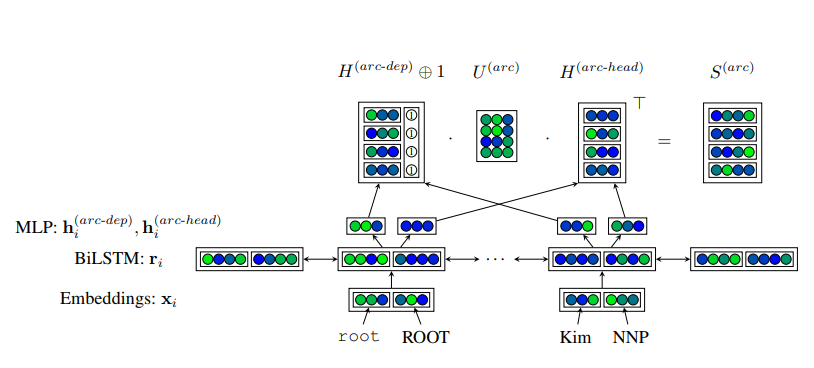
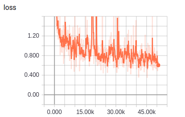
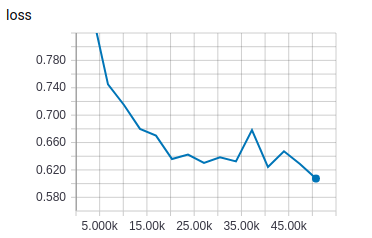
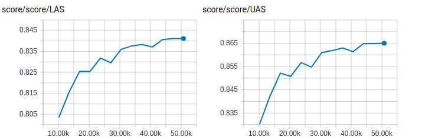

# Biaffine

TensorFlow implementation of [Deep Biaffine Attention for Neural Dependency Parsing](https://arxiv.org/pdf/1611.01734.pdf). (2016. 11)



## Requirements

- Python 3
- TensorFlow 1.5


## Project Structure


    ├── config                  # Config files (.yml)
    ├── network                 # define network
    ├── data_loader.py          # raw_data -> tfrecord -> dataset
    ├── main.py                 # train and eval
    ├── predict.py              # predict
    ├── utils.py                # config tools
    ├── hooks.py                # train and eval hooks
    └── model.py                # define model, loss, optimizer
    

## Config

biaffine.yml

```yml
data:
  dataset_path: '~/data/dataset/nlp/dependency-parsing/'
  processed_path: '~/data/processed-data/nlp/dependency-parsing/biaffine/'

  train_data: 'train.conll'
  test_data: 'test.conll'

  vocab_file: 'vocab.txt'
  pos_file: 'pos.txt'
  dep_file: 'dep.txt'
  wordvec_file: 'wordvec.txt'
  wordvec_pkl: 'wordvec.pkl'

model:
  lstm_size: 400
  arc_mlp_size: 500
  label_mlp_size: 100
  lstm_keep_prob: 0.67
  arc_keep_prob: 0.67
  label_keep_prob: 0.67
  embedding_keep_prob: 0.67

  word_embedding_size: 300
  pos_embedding_size: 100
  pos_num: 39
  dep_num: 46

train:
  batch_size: 20
  max_gradient_norm: 5.0

  initial_lr: 0.002

  epoch: 0
  max_epoch: 15

  model_dir: '~/data/logs/nlp/dependency-parsing/biaffine/'
  save_checkpoints_steps: 2000
```


## Run

**Process raw data**

Put data(.txt) in dataset_path  
Data must follow the format of example data  
Put wordvec(.txt) in processed_path

```
python data_loader.py
```

**Train**

```
python main.py --mode train
```

**Evaluate**

```
python main.py --mode eval
```

**Predict**  
```
python predict.py
```

## Experiments

Simplified training process of paper   
No fine tuning  
Run all evaluation on the test data

Dataset: ctb8.0 converted to stanford dependency format by stanfordnlp tool  
I found many obvious mistakes in dataset.  
This makes a **negative** impact on evaluation score.


|train loss|eval loss|
| :----------:| :----------: |
|||

|eval score|
| :----------:|
|**best UAS**: 0.8650 **best LAS**: 0.8412 |
||


## Example


```
input words (separated by space) -> 令 人 遗憾 的 是 , 他 至今 未 能 找到 令 自己 满意 的 答案 。
input tags (separated by space) -> VV NN VV DEC VC PU PN AD AD VV VV VV PN VV DEC NN PU
result ->
令	VV	5	top
人	NN	1	dobj
遗憾	VV	1	dep
的	DEC	1	cpm
是	VC	0	root
,	PU	5	punct
他	PN	11	nsubj
至今	AD	11	advmod
未	AD	11	advmod
能	VV	11	mmod
找到	VV	5	ccomp
令	VV	16	rcmod
自己	PN	12	dobj
满意	VV	12	dep
的	DEC	12	cpm
答案	NN	11	dobj
。	PU	5	punct

input words (separated by space) -> 对于 卷烟 ， 目前 还 是 一 种 合法 商品 ， 合法 的 商品 应该 有 合理 的 销售 价格 。
input tags (separated by space) -> P NN PU NT AD VC CD M JJ NN PU VA DEC NN VV VE VA DEC NN NN PU
result ->
对于	P	6	prep
卷烟	NN	1	pobj
,	PU	6	punct
目前	NT	6	dep
还	AD	6	advmod
是	VC	0	root
一	CD	8	nummod
种	M	10	clf
合法	JJ	10	amod
商品	NN	6	attr
,	PU	6	punct
合法	VA	14	rcmod
的	DEC	12	cpm
商品	NN	16	nsubj
应该	VV	16	mmod
有	VE	6	conj
合理	VA	20	rcmod
的	DEC	17	cpm
销售	NN	20	nn
价格	NN	16	dobj
。	PU	6	punct

input words (separated by space) -> 仅 清华 大学 报名点 ， 6 小时 之内 填表 人数 就 接近 2000 人 。
input tags (separated by space) -> AD NR NN NN PU CD NN LC NN NN AD VV CD NN PU
result ->
仅	AD	4	advmod
清华	NR	3	nn
大学	NN	4	nn
报名点	NN	12	nsubj
,	PU	12	punct
6	CD	7	nummod
小时	NN	8	lobj
之内	LC	12	loc
填表	NN	10	nn
人数	NN	12	nsubj
就	AD	12	advmod
接近	VV	0	root
2000	CD	14	nummod
人	NN	12	dobj
。	PU	12	punct
```


