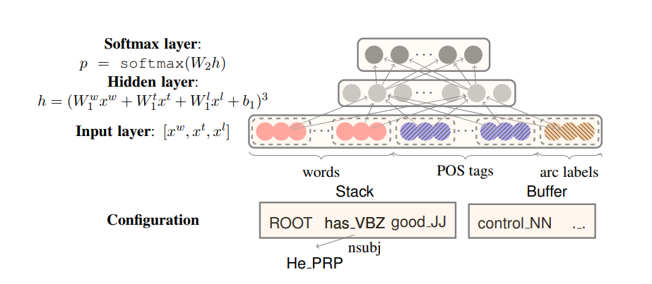
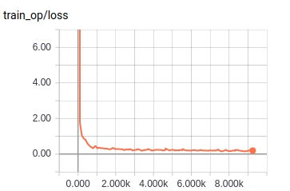

# MLP-Parser 

TensorFlow implementation of [A Fast and Accurate Dependency Parser using Neural Networks](https://cs.stanford.edu/~danqi/papers/emnlp2014.pdf). (2014. 08)



## Requirements

- Python 3
- TensorFlow 1.5


## Project Structure


    ├── config                  # Config files (.yml)
    ├── data                    # dataset path
    ├── logs                    # checkpoints
    ├── architecture                # architecture graphs (from input to logits)
        ├── __init__.py             # Graph logic
    ├── data_loader.py          # raw_data -> precossed_data -> generate_batch (using Dataset)
    ├── main.py                 # train
    ├── predict.py              # predict
    ├── utils.py                # config tools
    └── model.py                # define model, loss, optimizer
    

## Config

example: mlp-parser.yml

```
data:
  base_path: 'data/'
  num_stack_word: 3
  children_stack_range: 2
  wordvec_file: 'word_emb.pkl'
  posvec_file: 'pos_emb.pkl'
  depvec_file: 'dep_emb.pkl'
  num_dep: 39

model:
  fc1_unit: 200
  reg_scale: 0.00000001
  dropout_keep_prob: 0.5

train:
  batch_size: 2048
  learning_rate: 0.001
  optimizer: 'Adam'

  epoch: 10
  model_dir: 'logs/MLP-Parser'

  save_checkpoints_steps: 1000
  check_hook_n_iter: 100

  debug: False
```


## Run

Process raw data

```
python data_loader.py --config config/mlp-parser.yml
```

Train

```
python main.py --config config/mlp-parser.yml --mode train
```

Predict  

The data must follow CoNLL data format
```
python predict.py --config config/mlp-parser.yml --file xxx
```

## Tensorboard

  



## Example


```
********************
text:  no , it was n't black monday .
monday ---> black 	 amod
monday ---> n't 	 neg
monday ---> was 	 cop
monday ---> it 	 nsubj
monday ---> , 	 punct
monday ---> no 	 neg
monday ---> . 	 punct
<root> ---> monday 	 root
********************
text:  the interest-only securities will be sold separately by bt securities .
securities ---> interest-only 	 amod
securities ---> the 	 det
sold ---> be 	 auxpass
sold ---> will 	 aux
sold ---> securities 	 nsubj
sold ---> separately 	 advmod
securities ---> bt 	 compound
securities ---> by 	 case
sold ---> securities 	 nmod
sold ---> . 	 punct
<root> ---> sold 	 root
```