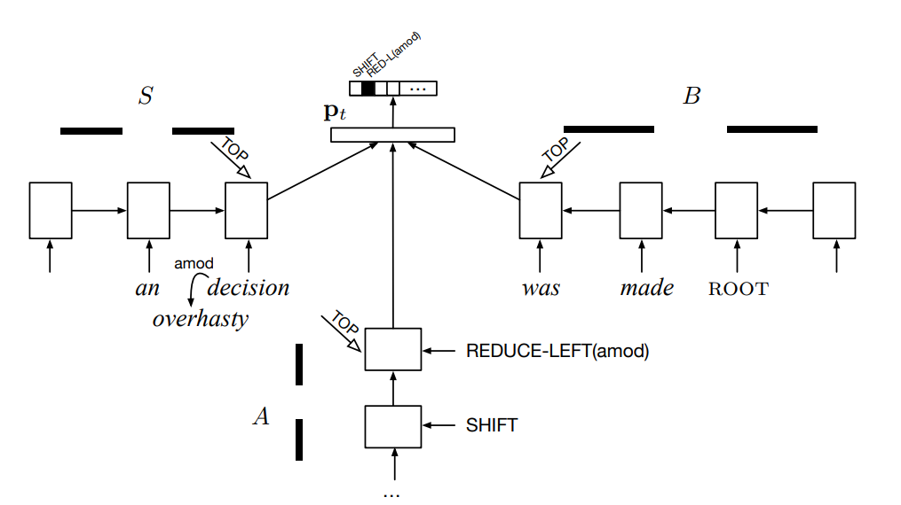
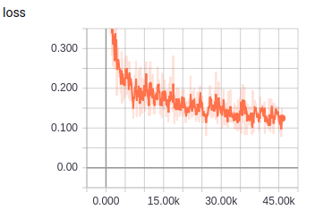
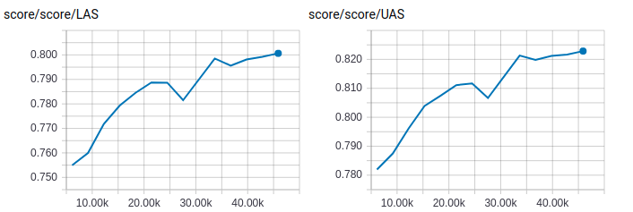

# Stack-LSTM+Swap

TensorFlow implementation of [Transition-Based Dependency Parsing with Stack Long Short-Term Memory](http://www.aclweb.org/anthology/P15-1033). (2015. 7)



## Environment

- Python 3.6
- TensorFlow 1.9
- Ubuntu 16.04


## Project Structure


    ├── config                  # Config files (.yml)
    ├── network                 # define network
    ├── data_loader.py          # raw_data -> tfrecord -> dataset
    ├── main.py                 # train and eval
    ├── predict.py              # predict
    ├── utils.py                # config tools
    ├── hooks.py                # train and eval hooks
    └── model.py                # define model, loss, optimizer
    

## Config

stack-lstm+swap.yml

```yml
data:
  dataset_path: '~/big_data/dataset/nlp/dependency-parsing/'
  processed_path: '~/big_data/processed-data/nlp/dependency-parsing/stack-lstm+swap/'

  train_data: 'train.conll'
  test_data: 'test.conll'

  vocab_file: 'vocab.txt'
  pos_file: 'pos.txt'
  dep_file: 'dep.txt'
  wordvec_file: 'wordvec.txt'
  wordvec_pkl: 'wordvec.pkl'

model:
  lstm_unit: 100
  lstm_layer_num: 2
  embedding_fc_unit: 50

  dep_num: 46
  pos_num: 38

  word_embedding_size: 300
  pos_embedding_size: 20
  history_action_embedding_size: 20
  comp_action_embedding_size: 20

train:
  batch_size: 512
  initial_lr: 0.1
  lr_decay: 0.1
  reg_scale: 0.000001
  max_gradient_norm: 5.0

  epoch: 0
  max_epoch: 15

  model_dir: '~/big_data/logs/nlp/dependency-parsing/stack-lstm+swap/'
  save_checkpoints_steps: 2000
```


## Run

**Process raw data**

Put data(.conll) in dataset_path  
Data must follow the format of example data  
Put wordvec(.txt) in processed_path

```
python data_loader.py
```

**Train**

```
python main.py --mode train
```

**Evaluate**

```
python main.py --mode eval
```

**Predict**  
```
python predict.py
```

## Experiments

Simplified training process of paper   
No fine tuning  
Run all evaluation on the test data

Dataset: ctb8.0 converted to stanford dependency format by stanfordnlp tool  
I found many obvious mistakes in dataset.  
This makes a **negative** impact on evaluation score.


|train loss|
| :----------:|
||

|eval score|
| :----------:|
|**best UAS**: 0.8229 **best LAS**: 0.8006 |
||


## Example


```
input words (separated by space) -> 允许 各 种 投资 形式 ， 鼓励 上市 兼并 重组 。
input tags (separated by space) -> VV DT M NN NN PU VV NN NN NN PU
result ->
允许	VV	0	root
各	DT	5	det
种	M	2	clf
投资	NN	5	nn
形式	NN	1	dobj
,	PU	1	punct
鼓励	VV	1	dep
上市	NN	10	nn
兼并	NN	10	nn
重组	NN	7	dobj
。	PU	1	punct

input words (separated by space) -> 探索 成立 合资 产业 基金 和 风险 投资 基金 的 可行性 ， 鼓励 出口 并且 放宽 出口 退税 。
input tags (separated by space) -> VV VV JJ NN NN CC NN NN NN DEC NN PU VV NN CC VV NN NN PU
result ->
探索	VV	0	root
成立	VV	11	rcmod
合资	JJ	4	amod
产业	NN	9	nn
基金	NN	9	conj
和	CC	9	cc
风险	NN	9	nn
投资	NN	9	nn
基金	NN	2	dobj
的	DEC	2	cpm
可行性	NN	1	dobj
,	PU	1	punct
鼓励	VV	1	dep
出口	NN	13	dobj
并且	CC	13	cc
放宽	VV	13	dep
出口	NN	18	nn
退税	NN	16	dobj
。	PU	1	punct

input words (separated by space) -> 我 是否 该 在 每次 换 工作 的 时候 买卖 我 的 房屋 ？
input tags (separated by space) -> PN AD VV P AD VV NN DEC NN VV PN DEG NN PU
result ->
我	PN	10	nsubj
是否	AD	10	advmod
该	VV	10	mmod
在	P	10	prep
每次	AD	6	advmod
换	VV	9	rcmod
工作	NN	6	dobj
的	DEC	6	cpm
时候	NN	4	pobj
买卖	VV	0	root
我	PN	13	assmod
的	DEG	11	assm
房屋	NN	10	dobj
?	PU	10	punct
```


