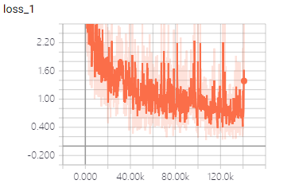
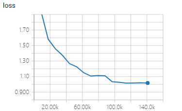
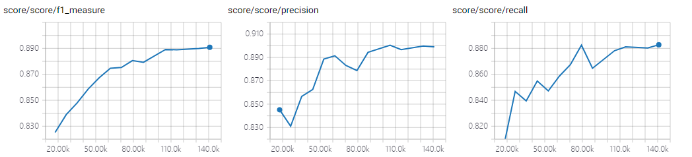

# BiLSTM-CRF 

TensorFlow implementation of [Neural Architectures for Named Entity Recognition](https://arxiv.org/pdf/1603.01360.pdf). (2016. 03)


## Requirements

- Python 3
- TensorFlow 1.5


## Project Structure


    ├── config                  # Config files (.yml)
    ├── network                 # define network
    ├── data_loader.py          # raw_data -> tfrecord -> dataset
    ├── main.py                 # train and eval
    ├── predict.py              # predict
    ├── utils.py                # config tools
    ├── hooks.py                # train and eval hooks
    └── model.py                # define model, loss, optimizer
    

## Config

bilstm-crf.yml

```yml
data:
  dataset_path: '~/data/dataset/nlp/ner/'
  processed_path: '~/data/processed-data/nlp/ner/bilism-crf/'

  train_data: 'train.txt'
  test_data: 'test.txt'

  vocab_file: 'vocab.txt'
  tag_file: 'tag.txt'
  wordvec_file: 'wordvec.txt'
  wordvec_pkl: 'wordvec.pkl'

model:
  lstm_unit: 100
  fc_unit: 13
  dropout_keep_prob: 0.5
  embedding_size: 100

train:
  batch_size: 20
  max_gradient_norm: 5.0

  initial_lr: 0.01

  epoch: 0
  max_epoch: 15

  model_dir: '~/data/logs/nlp/ner/bilism-crf/'
  save_checkpoints_steps: 2000
```


## Run

**Process raw data**

Put data(.txt) in dataset_path  
Data must follow the format of example data (I add prefix to every sentence coz I jointly train multi-corpus)   
Put wordvec(.txt) in processed_path

```
python data_loader.py
```

**Train**

```
python main.py --mode train
```

**Evaluate**

```
python main.py --mode eval
```

**Predict**  
```
python predict.py
```

## Experiments

Simplified training process of paper   
No fine tuning  
Run all evaluation on the test data

Dataset: self-made   
I combined several small datasets together, of which tagging standards are not consistent.  
This makes a big **negative** impact on evaluation score.


|train loss|eval loss|
| :----------:| :----------: |
|||

|eval score|
| :----------:|
|**best F**: 0.8908 **best P**: 0.9005 **best R**: 0.8828 |
||


## Example

PER-人名 LOC-地点 ORG-组织

```
input -> 法国队主教练德尚带领球员进行训练。当日，法国队在俄罗斯下诺夫哥罗德训练，备战与乌拉圭队的足球赛。
result -> [法国队]ORG 主教练 [德尚]PER 带领球员进行训练。当日， [法国队]ORG 在 [俄罗斯]LOC  [下诺夫哥罗德]LOC 训练，备战与 [乌拉圭队]ORG 的足球赛。

input -> 苹果公司已经通知英特尔,它将不会在其2020年的产品系列中使用英特尔的5G调制解调器。
result -> [苹果公司]ORG 已经通知 [英特尔]ORG ,它将不会在其2020年的产品系列中使用 [英特尔]ORG 的5G调制解调器。

input -> 在多次指责德国没有提升其国防开支，来为北约“提供足够多的贡献”后，特朗普近日更是直接点出了德国总理默克尔的名字，抨击其有钱从俄罗斯购买石油和天然气，却没有为北约拿出足够多的“份子钱”。
result -> 在多次指责 [德国]LOC 没有提升其国防开支，来为 [北约]ORG “提供足够多的贡献”后， [特朗普]PER 近日更是直接点出了 [德国]LOC 总理 [默克尔]PER 的名字，抨击其有钱从 [俄罗斯]LOC 购买石油和天然气，却没有为 [北约]ORG 拿出足够多的“份子钱”。

input -> 俄罗斯总统普京在克里姆林宫接受了中国中央广播电视总台台长慎海雄的独家专访。
result -> [俄罗斯]LOC 总统 [普京]PER 在 [克里姆林宫]LOC 接受了 [中国中央广播电视总台]ORG 台长 [慎海雄]PER 的独家专访。

input -> 伊朗法尔斯通讯社6月28日报道称，叙利亚军队在代尔祖尔省东南部的战斗中全面清除了“伊斯兰国”极端组织在巴迪耶（沙漠）的恐怖分子残余。
result ->  [伊朗法尔斯通讯社]ORG 6月28日报道称， [叙利亚]LOC 军队在 [代尔祖尔省]LOC 东南部的战斗中全面清除了“伊斯兰国”极端组织在 [巴迪耶]LOC （沙漠）的恐怖分子残余。

```


