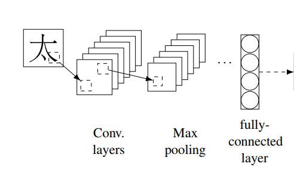
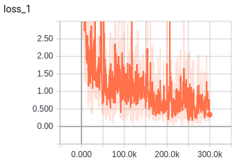
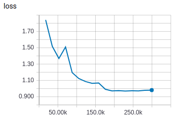
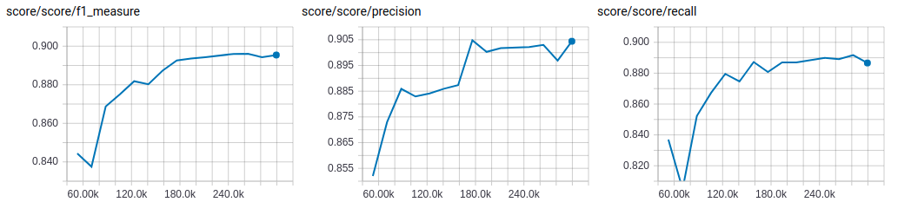

# CNN-BiLSTM-CRF 

TensorFlow implementation of [End-to-end Sequence Labeling via Bi-directional LSTM-CNNs-CRF](https://arxiv.org/pdf/1603.01354.pdf). (2016. 03)



## Environment

- Python 3.6
- TensorFlow 1.7
- pygame (build char images)
- Ubuntu 16.04


## Project Structure


    ├── config                  # Config files (.yml)
    ├── network                 # define network
    ├── data_loader.py          # raw_data -> tfrecord -> dataset
    ├── main.py                 # train and eval
    ├── predict.py              # predict
    ├── utils.py                # config tools
    ├── hooks.py                # train and eval hooks
    └── model.py                # define model, loss, optimizer
    

## Config

cnn-bilstm-crf.yml

```yml
data:
  dataset_path: '~/data/dataset/nlp/ner/'
  processed_path: '~/data/processed-data/nlp/ner/cnn-bilstm-crf/'

  train_data: 'train.txt'
  test_data: 'test.txt'

  vocab_file: 'vocab.txt'
  tag_file: 'tag.txt'
  wordvec_file: 'wordvec.txt'
  wordvec_pkl: 'wordvec.pkl'

  char_pkl: 'char.pkl'

model:
  char_image_size: 32

  lstm_unit: 100
  fc_unit: 13
  dropout_keep_prob: 0.5
  embedding_size: 100

train:
  batch_size: 10
  max_gradient_norm: 5.0

  initial_lr: 0.01

  epoch: 0
  max_epoch: 15

  model_dir: '~/data/logs/nlp/ner/cnn-bilstm-crf/'
  save_checkpoints_steps: 2000
```


## Run

**Process raw data**

Put data(.txt) in dataset_path  
Data must follow the format of example data (I add prefix to every sentence coz I jointly trained multi-corpus)   
Put wordvec(.txt), simsun.ttc in processed_path

```
python data_loader.py
```

**Train**

```
python main.py --mode train
```

**Evaluate**

```
python main.py --mode eval
```

**Predict**  
```
python predict.py
```

## Experiments

Simplified training process of paper   
No fine tuning  
Run all evaluation on the test data

Dataset: self-made   
I combined several small datasets together, of which tagging standards are inconsistent.  
This makes a **negative** impact on evaluation score.


|train loss|eval loss|
| :----------:| :----------: |
|||

|eval score|
| :----------:|
|**best F**: 0.8960 **best P**: 0.9048 **best R**: 0.8917 |
||

CNN-BiLSTM-CRF is very slightly better than BiLSTM-CRF on my self-made dataset, of which tagging standards is inconsistent.  
Requires double training time of BiLSTM-CRF, and much more GPU memory.  
Need more datasets to test.


## Example

PER-人名 LOC-地点 ORG-组织

```
input -> 比赛由亚洲皮划艇联合会主办，中国皮划艇协会、云南省体育局、大理州人民政府、大理市人民政府承办，国家体育总局水上运动管理中心提供支持。
result -> 比赛由 [亚洲皮划艇联合会]ORG 主办, [中国皮划艇协会]ORG 、 [云南省体育局]ORG 、 [大理州人民政府]ORG 、 [大理市人民政府]ORG 承办, [国家体育总局水上运动管理中心]ORG 提供支持。

input -> 中国人民银行行长易纲在保加利亚出席第七次中国-中东欧国家领导人会晤期间，应保加利亚国民银行行长迪米塔尔·拉德夫邀请，访问了保加利亚国民银行
result ->  [中国人民银行]ORG 行长 [易纲]PER 在 [保加利亚]LOC 出席第七次 [中国]LOC - [中东欧]LOC 国家领导人会晤期间,应 [保加利亚国民银行]ORG 行长 [迪米塔尔·拉德夫]PER 邀请,访问了 [保加利亚国民银行]ORG

input -> 意大利与欧盟积极讨论了明年预算目标，“远不是时候”透露新的财赤目标--财政部消息
result ->  [意大利]LOC 与 [欧盟]ORG 积极讨论了明年预算目标，“远不是时候”透露新的财赤目标-- [财政部]ORG 消息

input -> 俄罗斯经济发展部6号发布声明，俄罗斯总理梅德韦杰夫已经签署法案，就美国加征钢铝关税采取反制措施
result ->  [俄罗斯经济发展部]ORG 6号发布声明， [俄罗斯]LOC 总理 [梅德韦杰夫]PER 已经签署法案，就 [美国]LOC 加征钢铝关税采取反制措施

input -> 新华社上海电（记者朱翃郭敬丹）为了让青少年们有个寓教于乐的暑期，上海大鲨鱼男篮与上海静安区教育局携手，为孩子们带来“静安区青少年篮球嘉年华”活动。
result ->  [新华社]ORG  [上海]LOC 电(记者 [朱翃]PER  [郭敬丹]PER )为了让青少年们有个寓教于乐的暑期, [上海]LOC 大鲨鱼男篮与 [上海静安区教育局]ORG 携手,为孩子们带来“ [静安区]LOC 青少年篮球嘉年华”活动。
```


