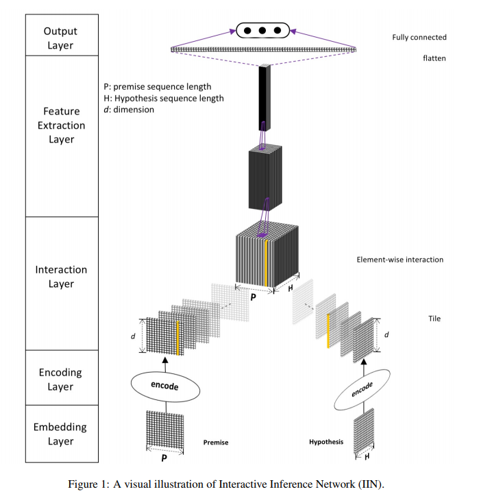
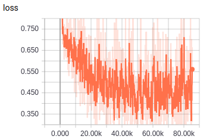
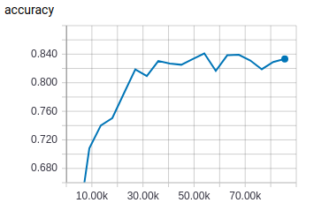

# DIIN

TensorFlow implementation of [Natural Language Inference over Interaction Space](https://arxiv.org/pdf/1709.04348.pdf). (2017. 9)



## Environment

- Python 3.6
- TensorFlow 1.9
- Ubuntu 16.04


## Project Structure


    ├── config                  # Config files (.yml)
    ├── network                 # define network
    ├── data_loader.py          # raw_data -> tfrecord -> dataset
    ├── main.py                 # train and eval
    ├── predict.py              # predict
    ├── utils.py                # config tools
    └── model.py                # define model, loss, optimizer
    

## Config

diin.yml

```yml
data:
  dataset_path: '~/big_data/dataset/nlp/natural-language-inference/'
  processed_path: '~/big_data/processed-data/nlp/natural-language-inference/diin/'

  train_data: 'train.txt'
  test_data: 'test.txt'

  vocab_file: 'vocab.txt'
  pos_file: 'pos.txt'
  wordvec_file: 'wordvec.txt'
  wordvec_pkl: 'wordvec.pkl'

model:
  max_seq_length: 50
  char_image_size: 32
  max_char: 6
  feature_scale_ratio: 0.3
  dense_transition_ratio: 0.5
  cnn_dense_units: 100
  highway_num: 2
  dense_block_num: 3
  dense_layer_per_block: 3

  pos_num: 29

  word_embedding_size: 300
  pos_embedding_size: 50

train:
  batch_size: 20
  switch_optimizer: 0
  initial_lr: 0.5
  sgd_lr: 0.0003
  l2_full_ratio: 0.0001
  constraint_scale: 0.001
  dropout_decay: 0.92
  epoch: 9
  max_epoch: 20

  model_dir: '~/big_data/logs/nlp/natural-language-inference/diin/'
  save_checkpoints_steps: 2000
```


## Run

**Process raw data**

Put data(.txt) in dataset_path  
Data must follow the format of example data  
Put wordvec(.txt) in processed_path

```
python data_loader.py
```

**Train**

```
python main.py --mode train
```

**Evaluate**

```
python main.py --mode eval
```

**Predict**  
```
python predict.py
```

## Experiments

Simplified training process of paper   
No fine tuning  
Run all evaluation on the test data

Dataset: [biendata](https://biendata.com/competition/CCKS2018_3/)  

|train loss|eval loss|
| :----------:| :----------: |
|||

|eval accuracy|
| :----------:|
|**best accuracy**: 0.8410|
||


## Example


```
input premise words (separated by space) -> 借款 失败 的 原因 这 是 什么 原因
input premise tags (separated by space) -> v v u n r v r n
input hypothesis words (separated by space) -> 为什么 借 不 出
input hypothesis tags (separated by space) -> r v d v
result ->
句子一: 借款失败的原因这是什么原因
句子二: 为什么借不出
结果: 相同意图

input premise words (separated by space) -> 开通 了 没有 额度
input premise tags (separated by space) -> v u v n
input hypothesis words (separated by space) -> 微拉 能 强 开 吗 ？
input hypothesis tags (separated by space) -> nh v a v u wp
result ->
句子一: 开通了没有额度
句子二: 微拉能强开吗?
结果: 不同意图

input premise words (separated by space) -> 出现 身份证 输入 错误 ， 可 我 输 的 都 对 的 ， 说 无法 借款
input premise tags (separated by space) -> v n v n wp c r v u d a u wp v v v
input hypothesis words (separated by space) -> 怎么 借款 提示 身份 信息 错误 多次
input hypothesis tags (separated by space) -> r v v n n n m
result ->
句子一: 出现身份证输入错误,可我输的都对的,说无法借款
句子二: 怎么借款提示身份信息错误多次
结果: 相同意图

input premise words (separated by space) -> 借 的 钱 是 直接 打入 绑定 的 银行卡 吗 ？
input premise tags (separated by space) -> v u n v a v v u n u wp
input hypothesis words (separated by space) -> 确认 电话 是 会 打 到 银行卡 绑定 号码 还是 微信 绑定 号码 ？
input hypothesis tags (separated by space) -> v n v v v v n v n v n v n wp
result ->
句子一: 借的钱是直接打入绑定的银行卡吗?
句子二: 确认电话是会打到银行卡绑定号码还是微信绑定号码?
结果: 不同意图

input premise words (separated by space) -> 今天 没 接到 电话 ， 现在 能 打 过来 吗 ？
input premise tags (separated by space) -> nt d v n wp nt v v v u wp
input hypothesis words (separated by space) -> 已 申请 未 接到 确认 电话
input hypothesis tags (separated by space) -> d v d v v n
result ->
句子一: 今天没接到电话,现在能打过来吗?
句子二: 已申请未接到确认电话
结果: 相同意图
```


