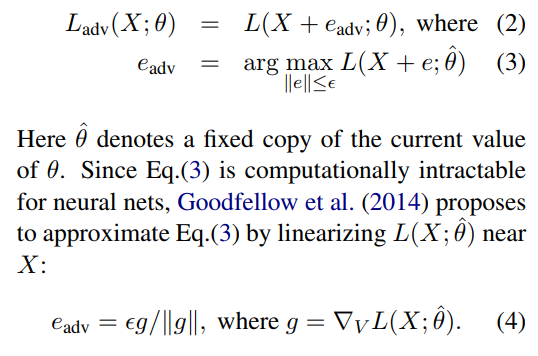
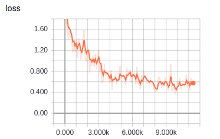

# BiGRU-Adversarial-Soft Label

TensorFlow implementation of [Adversarial Training for Relation Extraction](https://www.aclweb.org/anthology/D17-1187). (2017. 9)



## Environment

- Python 3.6
- TensorFlow 1.9
- Ubuntu 16.04


## Project Structure


    ├── config                  # Config files (.yml)
    ├── network                 # define network
    ├── data_loader.py          # raw_data -> tfrecord -> dataset
    ├── main.py                 # train and eval
    ├── predict.py              # predict
    ├── utils.py                # config tools
    └── model.py                # define model, loss, optimizer
    

## Config

bigru-adv-soft_label.yml

```yml
data:
  dataset_path: '~/big_data/dataset/nlp/relation-extraction/'
  processed_path: '~/big_data/processed-data/nlp/relation-extraction/bigru-adv-soft_label/'

  train_data: 'train.txt'

  vocab_file: 'vocab.txt'
  tag_file: 'tag.txt'
  rel_file: 'rel.txt'
  entity_file: 'entity.txt'
  wordvec_file: 'wordvec.txt'
  wordvec_pkl: 'wordvec.pkl'

model:
  class_num: 12
  gru_units: 200
  dropout_keep_prob: 0.5
  epsilon: 0.02
  entity_indicator_size: 3
  word_embedding_size: 100

train:
  adversarial_training: 1
  soft_label: 1
  soft_label_start: 3000
  batch_size: 50
  initial_lr: 0.001
  max_steps: 12000

  model_dir: '~/big_data/logs/nlp/relation-extraction/bigru-adv-soft_label/'
  save_checkpoints_steps: 2000
```


## Run

**Process raw data**

Put data(.txt) in dataset_path  
Data must follow the format of example data
Put wordvec(.txt) in processed_path

```
python data_loader.py
```

**Train**

```
python main.py --mode train
```


**Predict**  
```
python predict.py
```

## Experiments

Simplified training process of paper   
No fine tuning  
No test data

Dataset: randomly download from web, which is very noisy   


|train loss|
| :----------:|
||


## Example


```
input text -> 李雷对于他的学生韩梅梅做出的成果非常骄傲！
input entity -> 李雷 韩梅梅
result -> 师生

input text -> 李雷的表舅叫韩梅梅的二妈为大姐
input entity -> 李雷 韩梅梅
result -> 亲戚

input text -> 李雷非常疼爱他的孙女韩梅梅小朋友。
input entity -> 李雷 韩梅梅
result -> 祖孙

input text -> 李雷与韩梅梅的组合表现出色。
input entity -> 李雷 韩梅梅
result -> 合作

input text -> 韩梅梅和她的丈夫李雷前日一起去英国旅行了。
input entity -> 李雷 韩梅梅
result -> 夫妻
```


