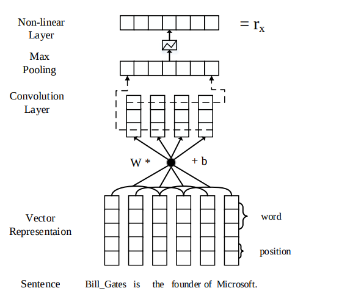
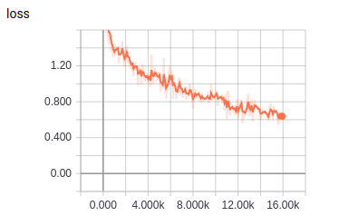

# PCNN-ATT

TensorFlow implementation of [Neural Relation Extraction with Selective Attention over Instances](http://aclweb.org/anthology/P16-1200). (2016. 8),  
and [Distant Supervision for Relation Extraction via Piecewise Convolutional Neural Networks](http://www.emnlp2015.org/proceedings/EMNLP/pdf/EMNLP203.pdf) (2015. 9)  



## Environment

- Python 3.6
- TensorFlow 1.9
- Ubuntu 16.04


## Project Structure


    ├── config                  # Config files (.yml)
    ├── network                 # define network
    ├── data_loader.py          # raw_data -> tfrecord -> dataset
    ├── main.py                 # train and eval
    ├── predict.py              # predict
    ├── utils.py                # config tools
    └── model.py                # define model, loss, optimizer
    

## Config

pcnn-att.yml

```yml
data:
  dataset_path: '~/big_data/dataset/nlp/relation-extraction/'
  processed_path: '~/big_data/processed-data/nlp/relation-extraction/pcnn-att/'

  train_data: 'train.txt'

  vocab_file: 'vocab.txt'
  tag_file: 'tag.txt'
  rel_file: 'rel.txt'
  entity_file: 'entity.txt'
  wordvec_file: 'wordvec.txt'
  wordvec_pkl: 'wordvec.pkl'

model:
  class_num: 12
  cnn_filters: 230
  dropout_keep_prob: 0.5
  position_embedding_size: 5
  word_embedding_size: 100

train:
  piece_pooling: 1
  batch_size: 160
  initial_lr: 0.01
  max_steps: 16000

  model_dir: '~/big_data/logs/nlp/relation-extraction/pcnn-att/'
  save_checkpoints_steps: 2000
```


## Run

**Process raw data**

Put data(.txt) in dataset_path  
Data must follow the format of example data
Put wordvec(.txt) in processed_path

```
python data_loader.py
```

**Train**

```
python main.py --mode train
```


**Predict**  
```
python predict.py
```

## Experiments

Simplified training process of paper   
No fine tuning  
No test data

Dataset: randomly download from web, which is very noisy   


|train loss|
| :----------:|
||


## Example


```
input text -> 李雷与韩梅梅的婚礼定于下周。
input entity -> 李雷 韩梅梅
result -> 夫妻

input text -> 韩梅梅和李雷的表演受到了大家的好评。
input entity -> 李雷 韩梅梅
result -> 合作

input text -> 李雷去参加韩梅梅的家长会
input entity -> 李雷 韩梅梅
result -> 父母

input text -> 李雷的表舅叫韩梅梅的二妈为大姐
input entity -> 李雷 韩梅梅
result -> 亲戚

input text -> 李雷非常疼爱他的孙女韩梅梅小朋友。
input entity -> 李雷 韩梅梅
result -> 祖孙
```


