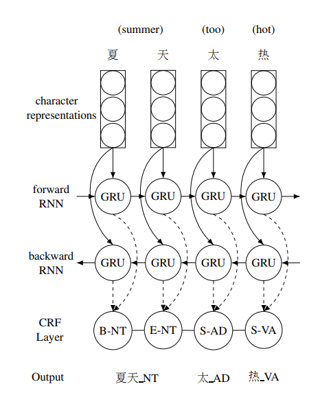
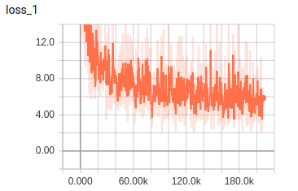
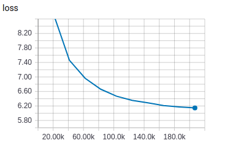
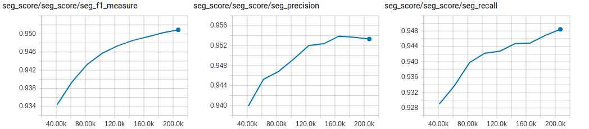
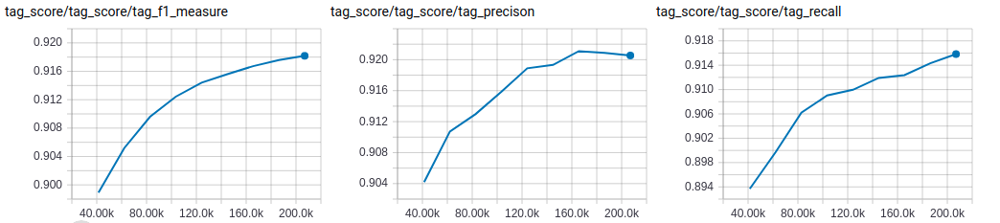
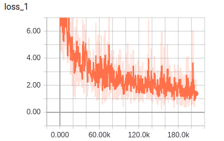
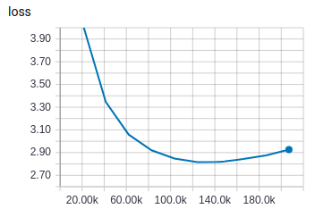
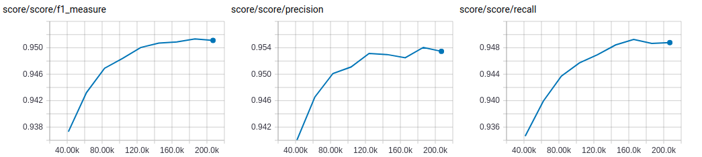

# Joint Segmentation and POS Tagging 

TensorFlow implementation of [Character-based Joint Segmentation and POS Tagging for Chinese
using Bidirectional RNN-CRF](https://arxiv.org/pdf/1704.01314.pdf). (2017. 4)



## Environment

- Python 3.6
- TensorFlow 1.7
- Ubuntu 16.04


## Project Structure


    ├── config                  # Config files (.yml)
    ├── network                 # define network
    ├── data_loader.py          # raw_data -> tfrecord -> dataset
    ├── main.py                 # train and eval
    ├── predict.py              # predict
    ├── utils.py                # config tools
    ├── hooks.py                # train and eval hooks
    └── model.py                # define model, loss, optimizer
    

## Config

joint-seg-tag.yml

```yml
data:
  dataset_path: '~/data/dataset/nlp/seg-tag/cnc/'
  processed_path: '~/data/processed-data/nlp/seg-tag/joint-seg-tag/joint/'

  train_data: 'train.txt'
  test_data: 'test.txt'

  vocab_file: 'vocab.txt'
  tag_file: 'tag.txt'
  wordvec_file: 'wordvec.txt'
  wordvec_pkl: 'wordvec.pkl'

model:
  gru_unit: 200
  fc_unit: 132
  dropout_keep_prob: 0.5
  embedding_size: 100

train:
  batch_size: 10
  max_gradient_norm: 5.0

  initial_lr: 0.1
  decay_rate: 0.15

  epoch: 0
  max_epoch: 10

  model_dir: '~/data/logs/nlp/seg-tag/joint-seg-tag/tag-ngram'
  save_checkpoints_steps: 2000
```


## Run

**Process raw data**

Put data(.txt) in dataset_path  
Data must follow the format of example data  
Put wordvec(.txt) in processed_path

```
python data_loader.py
```

**Train**

```
python main.py --mode train
```

**Evaluate**

```
python main.py --mode eval
```

**Predict**  
```
python predict.py
```


## Experiments

Simplified training process of paper   
No fine tuning  
Run all evaluation on the test data

Dataset: CNC 


**joint seg and tag**

|train loss|eval loss|
| :----------:| :----------: |
|||

|segmentation eval score|
| :----------:|
|**best F**: 0.9509 **best P**: 0.9539 **best R**: 0.9485 |
||

|pos tagging eval score|
| :----------:|
|**best F**: 0.9182 **best P**: 0.9211 **best R**: 0.9158 |
||

**seg only**

|train loss|eval loss|
| :----------:| :----------: |
|||

|segmentation eval score|
| :----------:|
|**best F**: 0.9514 **best P**: 0.9541 **best R**: 0.9493 |
||

 
On this dataset, seg-tag-joint result is same as seg-only result.   
Need more experiments to get conclusion.


## Example


```
input -> CNC是由国家语委公布的语料库。
result -> CNC/ws 是/vl 由/p 国家/n 语委/j 公布/v 的/u 语料库/n 。/w

input -> 这几天，西安的气温一直飙升，很多人都盼望一场雨的到来。
result -> 这/r 几/m 天/nt ，/w 西安/ns 的/u 气温/n 一直/d 飙升/v ，/w 很多/a 人/n 都/d 盼望/v 一/m 场/q 雨/n 的/u 到来/v 。/w

input -> 这类任务要求输入文本后，模型能输出该文本的摘要。
result -> 这/r 类/n 任务/n 要求/v 输入/v 文本/n 后/nd ，/w 模型/n 能/vu 输出/v 该/r 文本/n 的/u 摘要/v 。/w

input -> 问答模型的输入由问题和上下文两部分组成，其中包含输出答案所需的信息。
result -> 问答/v 模型/n 的/u 输入/v 由/p 问题/n 和/c 上下文/n 两/m 部分/n 组成/v ，/w 其中/nd 包含/v 输出/v 答案/n 所/u 需/v 的/u 信息/n 。/w

input -> 朝鲜弃核承诺受考验被指试图欺骗美国。
result -> 朝鲜/ns 弃核/v 承诺/n 受/v 考验/v 被/p 指/v 试图/v 欺骗/v 美国/ns 。/w
```


