# Multi-Criteria

TensorFlow implementation of [Effective Neural Solution for Multi-Criteria Word Segmentation](https://arxiv.org/pdf/1712.02856.pdf). (2017. 12)

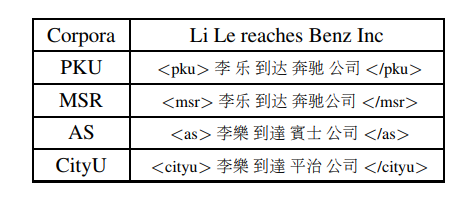

## Environment

- Python 3.6
- TensorFlow 1.7
- Ubuntu 16.04


## Project Structure


    ├── config                  # Config files (.yml)
    ├── network                 # define network
    ├── data_loader.py          # raw_data -> tfrecord -> dataset
    ├── main.py                 # train and eval
    ├── predict.py              # predict
    ├── utils.py                # config tools
    ├── hooks.py                # train and eval hooks
    └── model.py                # define model, loss, optimizer
    

## Config

multi-criteria.yml

```yml
data:
  dataset_path: '~/data/dataset/nlp/seg-tag/multi-txt/'
  processed_path: '~/data/processed-data/nlp/seg-tag/multi-criteria/multi'

  train_data: ['pku_training.utf8','msr_training.utf8','ctb_train.seg']
  test_data: ['pku_test_gold.utf8','msr_test_gold.utf8','ctb_test.seg']

  vocab_file: 'vocab.txt'
  wordvec_file: 'wordvec.txt'
  wordvec_pkl: 'wordvec.pkl'

model:
  lstm_unit: 100
  fc_unit: 4
  dropout_keep_prob: 0.8
  embedding_size: 100

train:
  batch_size: 20
  max_gradient_norm: 5.0

  learning_rate: 0.01
  learning_decay_rate: 0.8

  epoch: 0
  max_epoch: 10

  model_dir: '~/data/logs/nlp/seg-tag/multi-criteria/multi'
  save_checkpoints_steps: 2000
```


## Run

**Process raw data**  

Put data(.txt) in dataset_path  
Data must follow the format of example data  
Put wordvec(.txt) in processed_path

```
python data_loader.py
```

**Train**

```
python main.py --mode train
```

**Evaluate**

```
python main.py --mode eval
```

**Predict**  
```
python predict.py
```

## Experiments

Simplified training process of paper  
No fine tuning  
Run all evaluation on the test data

Dataset: pku, msr, ctb6 

**multi-criteria**

|multi train loss|pku eval loss|msr eval loss|ctb eval loss| 
| :----------:| :----------: | :-----: | :---: |
|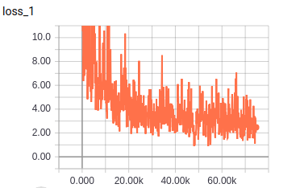|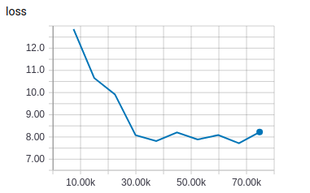|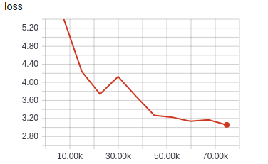|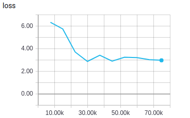

|pku eval score|
| :----------:|
|**best F**: 0.9306 **best P**: 0.9371 **best R**: 0.9243 |
|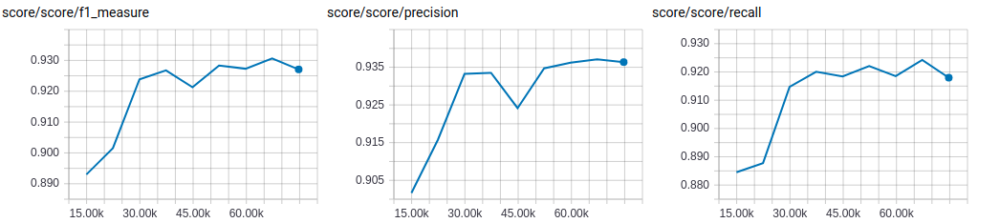|

|msr eval score|
| :----------:|
|**best F**: 0.9420 **best P**: 0.9447 **best R**: 0.9394 |
|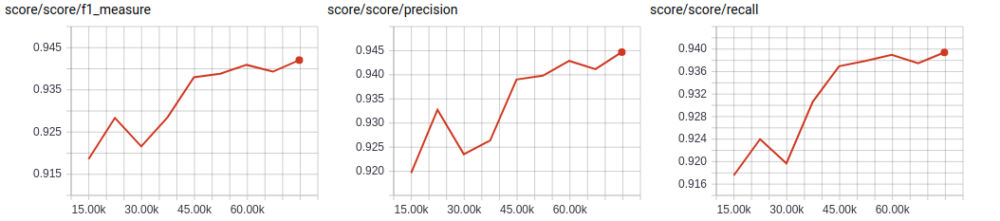|

|ctb eval score|
| :----------:|
|**best F**: 0.9457 **best P**: 0.9461 **best R**: 0.9453 |
|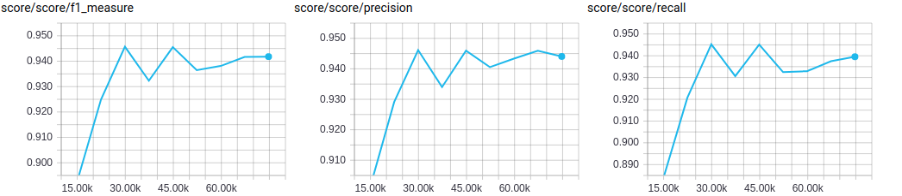|

**single-criteria**

|pku train loss|pku eval loss|
| :----------:| :----------: |
|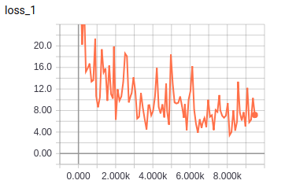|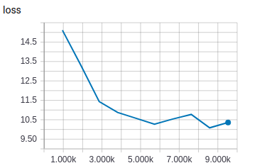|

|pku eval score|
| :----------:|
|**best F**: 0.9072 **best P**: 0.9172 **best R**: 0.8974 |
|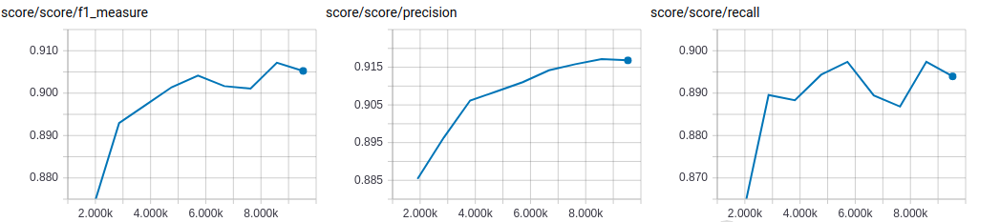|

|msr train loss|msr eval loss|
| :----------:| :----------: |
|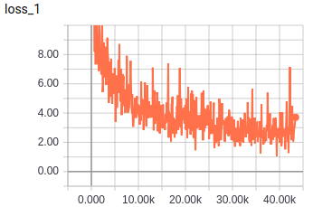|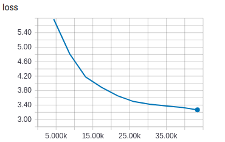|


|msr eval score|
| :----------:|
|**best F**: 0.9377 **best P**: 0.9371 **best R**: 0.9382 |
|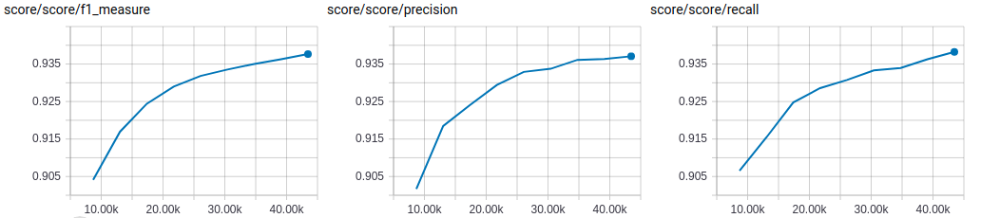|

|ctb train loss|ctb eval loss|
| :----------:| :----------: |
|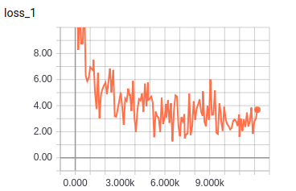|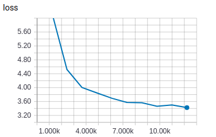|


|ctb eval score|
| :----------:|
|**best F**: 0.9343 **best P**: 0.9385 **best R**: 0.9328 |
|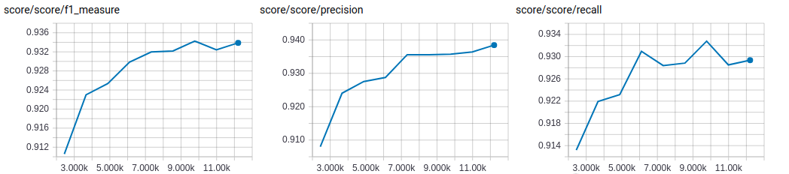|

All scores in multi-criteria are better than single-criteria.  
Conclude from experiments, multi-criteria does help segmentation results.
 
## Example

```
input -> 每个数据集自身的分词标准都不同，由于是在三个数据上统一训练，可以在首尾添加和训练数据相同的<>标签来选择想要的分词效果。
result -> ['每个', '数据集', '自身', '的', '分词', '标准', '都', '不同', '，', '由于', '是', '在', '三', '个', '数据', '上', '统一', '训练', '，', '可以', '在', '首尾', '添加', '和', '训练', '数据', '相同', '的', '<>', '标签', '来', '选择', '想要', '的', '分词', '效果', '。']

input -> 特朗普和保守派媒体则指责这是民主党利用“假新闻”，试图影响11月中期选举的阴谋。
result -> ['特朗普', '和', '保守派', '媒体', '则', '指责', '这', '是', '民主党', '利用', '“', '假', '新闻', '”', '，', '试图', '影响', '11月', '中期', '选举', '的', '阴谋', '。']

input -> 目前我们已经安排了专门人员对这两枚导弹进行研究，研究结果将用于提高俄罗斯的武器系统。
result -> ['目前', '我们', '已经', '安排', '了', '专门', '人员', '对', '这', '两', '枚', '导弹', '进行', '研究', '，', '研究', '结果', '将', '用于', '提高', '俄罗斯', '的', '武器', '系统', '。']

input -> 在美国空袭过后，叙利亚军队发现了两枚没有爆炸的巡航导弹。
result -> ['在', '美国', '空袭', '过', '后', '，', '叙利亚', '军队', '发现', '了', '两', '枚', '没有', '爆炸', '的', '巡航', '导弹', '。']

input -> 对于机器翻译、文本摘要、Q&A、文本分类等自然语言处理任务来说，深度学习的出现一遍遍刷新了state-of-the-art的模型性能记录，给研究带来诸多惊喜。
result -> ['对于', '机器', '翻译', '、', '文本', '摘要', '、', 'Q&A', '、', '文本', '分类', '等', '自然', '语言', '处理', '任务', '来说', '，', '深度', '学习', '的', '出现', '一遍遍', '刷新', '了', 'state-of-the-art', '的', '模型', '性能', '记录', '，', '给', '研究', '带来', '诸多', '惊喜', '。']

```


