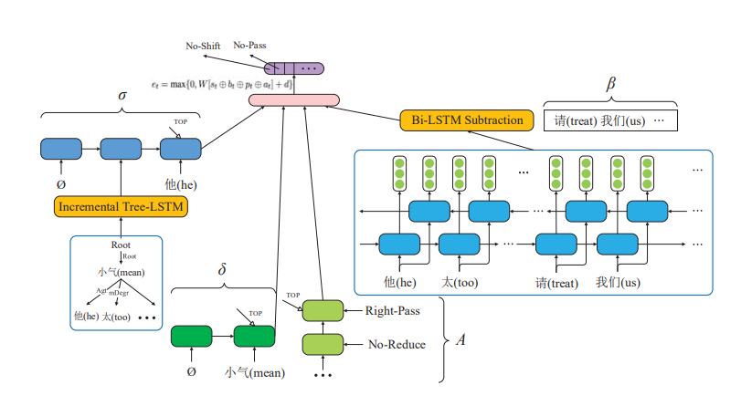
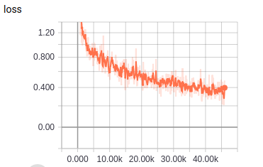
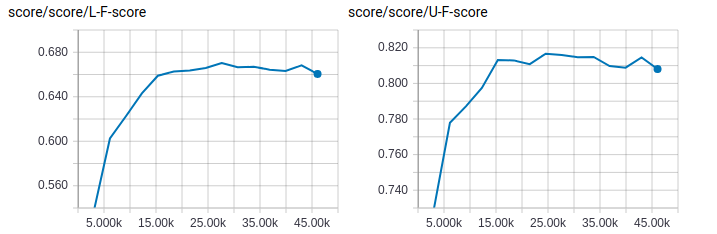

# Tree-LSTM+Deque

TensorFlow implementation of [A Neural Transition-Based Approach for Semantic Dependency Graph Parsing](http://alexyxwang.me/2017/11/19/A-Neural-Transition-Based-Approach-for-Semantic-Dependency-Graph-Parsing/Wang.pdf). (2017. 11)



## Environment

- Python 3.6
- TensorFlow 1.9
- Ubuntu 16.04


## Project Structure


    ├── config                  # Config files (.yml)
    ├── network                 # define network
    ├── data_loader.py          # raw_data -> tfrecord -> dataset
    ├── main.py                 # train and eval
    ├── predict.py              # predict
    ├── utils.py                # config tools
    ├── hooks.py                # train and eval hooks
    └── model.py                # define model, loss, optimizer
    

## Config

tree-lstm+deque.yml

```yml
data:
  dataset_path: '~/big_data/dataset/nlp/semantic-parsing/semeval2016/'
  processed_path: '~/big_data/processed-data/nlp/semantic-parsing/tree-lstm+deque/'

  train_data: ['train_1.conll','train_2.conll']
  test_data: ['test_1.conll','test_2.conll']

  vocab_file: 'vocab.txt'
  pos_file: 'pos.txt'
  dep_file: 'dep.txt'
  wordvec_file: 'wordvec.txt'
  wordvec_pkl: 'wordvec.pkl'

model:
  lstm_unit: 200
  embedding_fc_unit: 100

  dep_num: 157
  pos_num: 42

  word_embedding_size: 300
  pos_embedding_size: 50
  history_action_embedding_size: 50

train:
  batch_size: 256
  initial_lr: 0.1
  lr_decay: 0.1
  reg_scale: 0.000001

  max_gradient_norm: 5.0

  epoch: 0
  max_epoch: 15

  model_dir: '~/big_data/logs/nlp/semantic-parsing/tree-lstm+deque/'

  save_checkpoints_steps: 2000
```


## Run

**Process raw data**

Put data(.conll) in dataset_path  
Data must follow the format of example data  
Put wordvec(.txt) in processed_path

```
python data_loader.py
```

**Train**

```
python main.py --mode train
```

**Evaluate**

```
python main.py --mode eval
```

**Predict**  
```
python predict.py
```

## Experiments

Simplified training process of paper   
No fine tuning  
Run all evaluation on the test data

Dataset: SemEval2016   


|train loss|
| :----------:|
||

|eval score|
| :----------:|
|**best UF**: 0.8167 **best LF**: 0.6703 |
||


## Example


```
input words (separated by space) -> 我 打开 柜门 ， 站 在 柜门 前 一下 惊呆 了 。
input tags (separated by space) -> PN VV NN PU VV P NN LC AD VV SP PU
result ->
我	PN	2	Agt
我	PN	5	Agt
我	PN	10	Aft
打开	VV	0	Root
柜门	NN	2	Pat
,	PU	2	mPunc
站	VV	2	eSucc
在	P	7	mPrep
柜门	NN	5	Loc
前	LC	7	mRang
一下	AD	10	mTime
惊呆	VV	5	eSucc
了	SP	10	mTone
。	PU	10	mPunc

input words (separated by space) -> 我 的 祖母 住 在 一个 小 山村 里
input tags (separated by space) -> 我 的 祖母 住 在 一个 小 山村 里
result ->
我	PN	3	Poss
的	DEG	1	mAux
祖母	NN	4	Exp
住	NN	0	Root
在	P	8	mPrep
一个	AD	8	Qp
小	JJ	8	Desc
山村	NN	4	Loc
里	LC	4	mPunc

input words (separated by space) -> 校长 说 他 无法 出席 这次 会议 。
input tags (separated by space) -> NN VV PN AD NN DT NN PU
result ->
校长	NN	2	Agt
说	VV	0	Root
他	PN	5	Agt
无法	AD	5	mNeg
出席	NN	2	dCont
这次	DT	7	Desc
会议	NN	5	Cont
。	PU	2	mPunc
```


