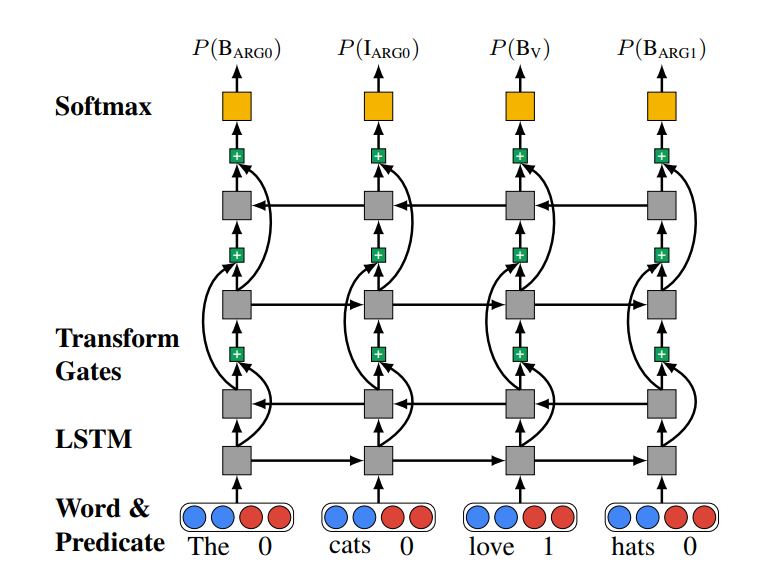
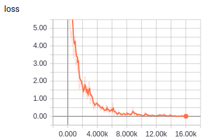
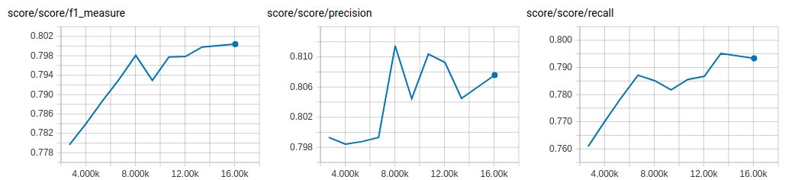

# BiLSTM-Highway

TensorFlow implementation of [Deep Semantic Role Labeling: What Works and What’s Next](https://homes.cs.washington.edu/~luheng/files/acl2017_hllz.pdf). (2017)



## Environment

- Python 3.6
- TensorFlow 1.7
- Ubuntu 16.04


## Project Structure


    ├── config                  # Config files (.yml)
    ├── network                 # define network
    ├── data_loader.py          # raw_data -> tfrecord -> dataset
    ├── main.py                 # train and eval
    ├── predict.py              # predict
    ├── utils.py                # config tools
    ├── hooks.py                # train and eval hooks
    └── model.py                # define model, loss, optimizer
    

## Config

bilstm-highway.yml

```yml
data:
  dataset_path: '~/big_data/dataset/nlp/semantic-role-labeling/'
  processed_path: '~/big_data/processed-data/nlp/semantic-role-labeling/bilstm-highway/'

  train_data: 'train.txt'
  test_data: 'test.txt'

  vocab_file: 'vocab.txt'
  tag_file: 'tag.txt'
  label_file: 'label.txt'
  wordvec_file: 'wordvec.txt'
  wordvec_pkl: 'wordvec.pkl'

model:
  num_lstm_layer: 4
  class_num: 78
  tag_num: 33
  lstm_unit: 300

  recurrent_keep_prob: 0.9
  softmax_keep_prob: 0.5

  word_embedding_size: 300
  tag_embedding_size: 50
  predicate_size: 3

train:
  batch_size: 50
  clip_gradients: 1.0

  epoch: 0
  max_epoch: 40

  model_dir: '~/big_data/logs/nlp/semantic-role-labeling/bilstm-highway/'
  save_checkpoints_steps: 2000
```


## Run

**Process raw data**

Put data(.txt) in dataset_path  
Data must follow the format of example data  
Put wordvec(.txt) in processed_path

```
python data_loader.py
```

**Train**

```
python main.py --mode train
```

**Evaluate**

```
python main.py --mode eval
```

**Predict**  
```
python predict.py
```

## Experiments

Simplified training process of paper   
No fine tuning  
Run all evaluation on the test data

Dataset: cpb  


|train loss|
| :----------:|
||

|eval score|
| :----------:|
|**best F**: 0.8004 **best P**: 0.8115 **best R**: 0.7952 |
||


## Example


```
input words (separated by space) -> 奥巴马 昨晚 在 白宫 发表 了 演说 。
input tags (separated by space) -> NR NT P NR VV AS NN PU
input predicate -> 发表
result ->
奥巴马　　 S-ARG0
昨晚　　　 S-ARGM-TMP
在　　　　 B-ARGM-LOC
白宫　　　 E-ARGM-LOC
发表　　　 rel  
了　　　　 O    
演说　　　 S-ARG1
。　　　　 O 

input words (separated by space) -> 俄罗斯 总统 叶利钦 和 德国 总理 科尔 出席 撤军 仪式 并 发表 了 讲话 。
input tags (separated by space) -> NR NN NR CC NR NN NR VV JJ NN CC VV AS NN PU
input predicate -> 出席
result ->
俄罗斯　　 B-ARG0
总统　　　 I-ARG0
叶利钦　　 I-ARG0
和　　　　 I-ARG0
德国　　　 I-ARG0
总理　　　 I-ARG0
科尔　　　 E-ARG0
出席　　　 rel  
撤军　　　 B-ARG1
仪式　　　 E-ARG1
并　　　　 O    
发表　　　 O    
了　　　　 O    
讲话　　　 O    
。　　　　 O 

input words (separated by space) -> 东道主 中国 体育 代表团 已 于 八月 二十五日 进驻 运动员村 。
input tags (separated by space) -> NN NR NN NN AD P NT NT VV NN PU
input predicate -> 进驻
result ->
东道主　　 B-ARG0
中国　　　 I-ARG0
体育　　　 I-ARG0
代表团　　 E-ARG0
已　　　　 S-ARGM-ADV
于　　　　 B-ARGM-TMP
八月　　　 I-ARGM-TMP
二十五日　 E-ARGM-TMP
进驻　　　 rel  
运动员村　 S-ARG1
。　　　　 O    

input words (separated by space) -> 我们 将 尽可能 安排 符合 资格 的 儿童 填补 现有 的 名额 空缺 。
input tags (separated by space) -> PN AD AD VV VV NN DEC NN VV JJ DEG NN NN PU
input predicate -> 安排
result ->
我们　　　 S-ARG0
将　　　　 B-ARGM-ADV
尽可能　　 E-ARGM-ADV
安排　　　 rel  
符合　　　 B-ARG1
资格　　　 I-ARG1
的　　　　 I-ARG1
儿童　　　 E-ARG1
填补　　　 B-ARG2
现有　　　 I-ARG2
的　　　　 I-ARG2
名额　　　 I-ARG2
空缺　　　 E-ARG2
。　　　　 O    

input words (separated by space) -> 过去 的 一 年 ， 中国 利用 外资 五百四十亿 美元 。
input tags (separated by space) -> NT DEG CD M PU NR VV NN CD M PU
input predicate -> 利用
result ->
过去　　　 B-ARGM-TMP
的　　　　 I-ARGM-TMP
一　　　　 I-ARGM-TMP
年　　　　 E-ARGM-TMP
,　　　　 O    
中国　　　 S-ARG0
利用　　　 rel  
外资　　　 B-ARG1
五百四十亿 I-ARG1
美元　　　 E-ARG1
。　　　　 O  
```
