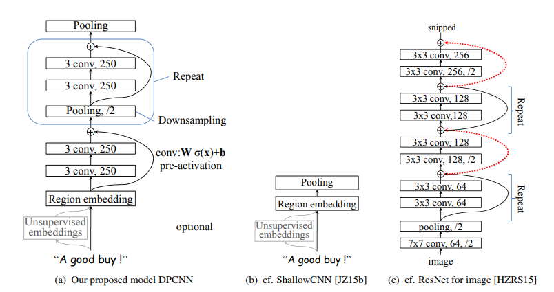
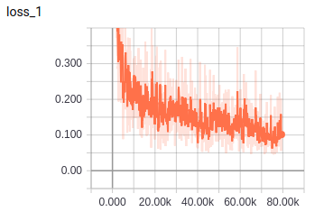
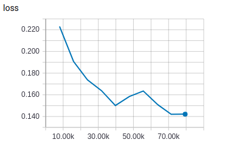
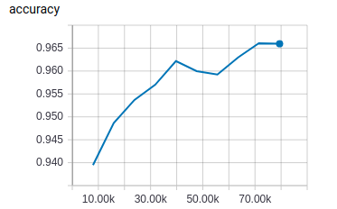
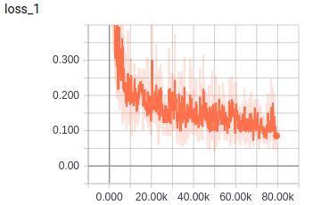
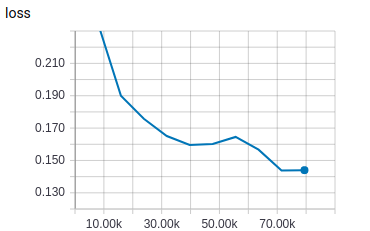
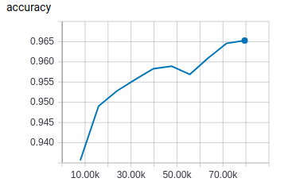
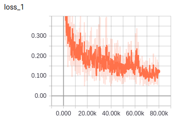
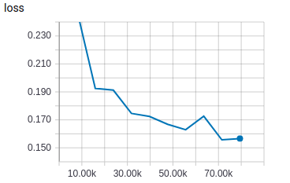
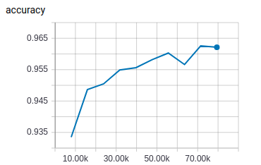

# DPCNN

TensorFlow implementation of [Deep Pyramid Convolutional Neural Networks for Text Categorization](http://aclweb.org/anthology/P17-1052). (2017. 8)



## Requirements

- Python 3
- TensorFlow 1.5


## Project Structure


    ├── config                  # Config files (.yml)
    ├── network                 # define network
    ├── data_loader.py          # raw_data -> tfrecord -> dataset
    ├── main.py                 # train and eval
    ├── predict.py              # predict
    ├── utils.py                # config tools
    └── model.py                # define model, loss, optimizer
    

## Config

dpcnn.yml

```yml
data:
  dataset_path: '~/data/dataset/nlp/classification/THUCNews/'
  processed_path: '~/data/processed-data/nlp/classification/dpcnn'
  train_data: 'train-files.txt'
  test_data: 'test-files.txt'

  vocab_file: 'vocab.txt'
  wordvec_file: 'wordvec.txt'
  wordvec_pkl: 'wordvec.pkl'

  max_sequence_length: 1000

model:
  kernel_sizes: [1, 3, 5]
  fixed_channel: 250
  fc_unit: 14
  embedding_size: 100
  max_conv_block_num: 7

train:
  batch_size: 100

  regular_weight: 0.0001
  dropout_keep_prob: 0.5

  learning_rate: 0.01

  epoch: 0
  max_epoch: 10
  model_dir: '~/data/logs/nlp/classification/dpcnn/conv-block-7'

  save_checkpoints_steps: 2000
```


## Run

**Process raw data**

Put data(.txt) in dataset_path  
Data must follow the format of example data  
Put wordvec(.txt) in processed_path

```
python data_loader.py
```

**Train**

```
python main.py --mode train
```

**Evaluate**

```
python main.py --mode eval
```

**Predict**  
```
python predict.py
```


## Experiments

Simplified training process of paper   
No fine tuning  
Run all evaluation on the test data

Dataset: THUCNews   
Split to 790k train samples and 47k test samples

**7 conv blocks**

|train loss|eval loss|best accuracy: 0.9661|
| :----------:| :----------: | :----------:|
||||

**5 conv blocks**

|train loss|eval loss|best accuracy: 0.9653|
| :----------:| :----------: | :----------:|
||||

**3 conv blocks**

|train loss|eval loss|best accuracy: 0.9626|
| :----------:| :----------: | :----------:|
||||

7-conv-blocks is slightly better than 3-conv-blocks.  
Training time of 100 batch of 7-conv-blocks is 26.5sec, while 3-conv-blocks is 25.0sec.  

## Example


```
总分类包括: 体育, 娱乐, 家居, 彩票, 房产, 教育, 时尚, 时政, 星座, 游戏, 社会, 科技, 股票, 财经

input -> 驻新泽西记者王忆琼1月6日报道  有人说最孤独的感觉，是在人潮汹涌的街头，却没人可以说话。1月6日的这个夜晚，阿联体会到了这种滋味。76比98输给雄鹿的这场比赛中，队友们都在他身边，也都在奔跑流汗，可没人能提供有效的帮助。阿联一个人12投7中，拿到全队最高的22分，也抵不住球队的溃败。整场比赛，球队里除了阿联，只有洛佩斯(11分)和罗伯茨(12分)得分上双。
result -> 体育

input -> 季潮流瞬息万变，闺蜜从法国回来新添了一个LV限量版手提袋，你立刻觉得自己缺斤少两，可钱包的厚度老是跟不上时尚的脚步，那些新品外套、针织衫、锥版裤、靴子···令你心情低落，时尚真的是恶魔吗？NO！不要让时尚变成压力，心态决定一切，我们一起把压力甩开，迎接快乐的“无压力时尚”。季潮流瞬息万变，闺蜜从法国回来新添了一个LV限量版手提袋，你立刻觉得自己缺斤少两，可钱包的厚度老是跟不上时尚的脚步，那些新品外套、针织衫、锥版裤、靴子···令你心情低落，时尚真的是恶魔吗？NO！不要让时尚变成压力，心态决定一切，我们一起把压力甩开，迎接快乐的“无压力时尚”。
result -> 时尚

input -> 据俄罗斯媒体报道，白宫6月9日在其网站上发布消息，美国总统奥巴马宣布延长对白俄罗斯的制裁一年。奥巴马向国会表示：“白俄罗斯政府的行为和政策......严重威胁到美国的国家安全和外交政策。我认为有必要对白俄罗斯继续实施制裁。”2006年3月白总统卢卡申科赢得连任后，美国声称白总统选举存在舞弊和侵犯人权行为，拒绝接受选举结果。随后不久，美国宣布将对包括卢卡申科在内的多名白政府官员进行经济制裁和国际旅行限制。2008年3月7日，白方宣布召回其驻美大使。美驻白大使卡伦？斯图尔特也于3月12日被迫回国。
result -> 时政

input -> 首先，美豆下方支撑强劲。3月31日美国农业部(USDA)公布的意向播种面积报告中，将美豆播种面积提高至7809.8万英亩，与2009年的7750万英亩相比增加0.8%。利空报告公布当天CBOT大豆期货出现暴跌，之后在930美分上方获得支撑。但据数据统计发现，最近10年中的8个年头里，大豆实际播种面积均低于美国农业部3月的意向报告预估，这意味着美豆实际播种面积还存在降低的可能。而后期美豆逐渐进入播种期，期间的天气状况、大豆/玉米的比价关系、临时改变种植计划的便利条件、农民对春耕的准备、安排将决定美豆真实的播种面积。随着市场关注的意向播种面积报告出台，后期美豆产区的天气炒作将逐渐浮出水面。
result -> 财经

input -> 早盘股指显著上涨了，但两市却是下跌的个股占多数，随着午间收盘前的跳水，个股已经是超过八成绿盘，大盘蓝筹股上涨、小盘股暴跌。早市领涨股指的是一线权重板块，比如银行、保险、券商、石油、煤炭等等，有色金属、地产、钢铁、电力、机械、基建等板块也是红盘；小盘股指数大跌近8%，跌势较显著的板块主要是电力设备、电子科技、物联网、通信、传媒、造纸、旅游、航空、化工化纤、电器、节能环保、纺织服装等等。创业板跳水暴跌、几乎全线逼近跌停板。
result -> 股票
```


