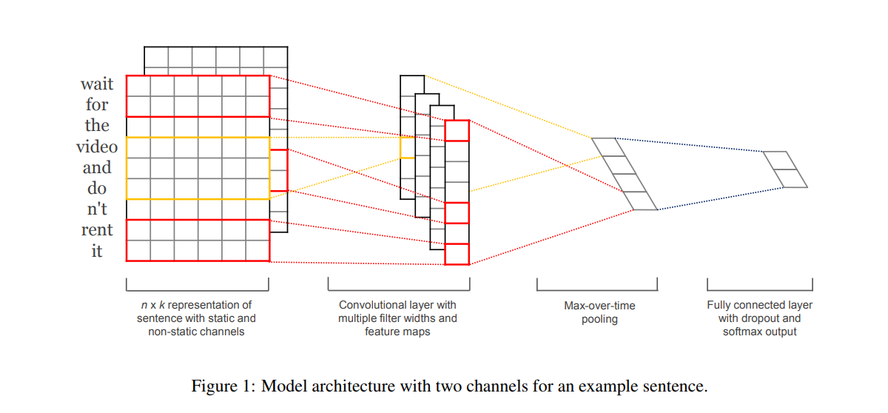

# TextCNN

TensorFlow implementation of [Convolutional Neural Networks for Sentence Classification](https://arxiv.org/pdf/1408.5882.pdf). (2014. 8)



## Requirements

- Python 3.6
- TensorFlow 1.6


## Project Structure


    ├── config                  # Config files (.yml)
    ├── data                    # dataset path
    ├── textcnn                 # textcnn architecture graphs (from input to logits)
        ├── __init__.py             # Graph logic
    ├── data_loader.py          # raw_data -> processed_data -> generate_batch (using Dataset)
    ├── main.py                 # train and evaluate
    ├── utils.py                # config tools 
    ├── predict.py              # predict
    └── model.py                # define model, loss, optimizer
    

## Config

example: thunews.yml

```yml
data:
  base_path: 'data/'
  raw_data_path: 'news'
  processed_path: 'processed_news'
  vocab_size: 5000
  num_classes: 10
  max_seq_length: 600

model:
  batch_size: 128
  embedding_dim: 200
  num_filters: 256
  kernel_sizes:
    - 3
    - 4
    - 5
  dropout_keep_prob: 0.5

train:
  learning_rate: 0.001
  learning_decay_steps: 1000
  learning_decay_rate: 0.8
  optimizer: 'Adam'

  max_steps: 20000
  model_dir: 'logs/thunews'

  save_checkpoints_steps: 391
  check_hook_n_iter: 100
  min_eval_frequency: 391

  debug: False
```

* `thunews` [download here](http://thuctc.thunlp.org/)

## Run

Process raw data

```
python data_loader.py --config config/thunews.yml
```

Train

```
python main.py --mode train --config config/thunews.yml
```

Predict

```
python predict.py --config config/thunews.yml
```


## Tensorboard

```tensorboard --logdir logs```

- thunews.yml (trained for 20mins on one Tesla K80)


## Example

```
> 江苏肯帝亚队在首轮被山东队3-0淘汰之后提前结束了本赛季的比赛，有着“小科比”之称的马尚-布鲁克斯却迎来了新的机遇
体育
> 平安国际金融中心招商活动全面启动平安国际金融中心自去年6月竣工，一直处于热租状态。
房产
> 华安基金管理公司董事变更 冯祖新先生上任
财经
```


