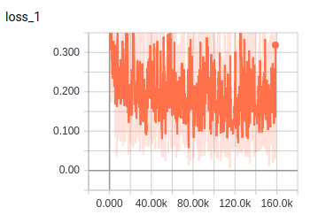
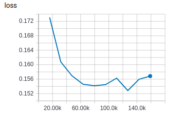
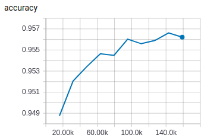

# TextCNN

TensorFlow implementation of [Convolutional Neural Networks for Sentence Classification](https://arxiv.org/pdf/1408.5882.pdf). (2014. 8)


## Requirements

- Python 3
- TensorFlow 1.5


## Project Structure


    ├── config                  # Config files (.yml)
    ├── network                 # define network
    ├── data_loader.py          # raw_data -> tfrecord -> dataset
    ├── main.py                 # train and eval
    ├── predict.py              # predict
    ├── utils.py                # config tools
    └── model.py                # define model, loss, optimizer
    

## Config

textcnn.yml

```yml
data:
  dataset_path: '~/data/nlp/classification/THUCNews/'
  processed_path: '~/data/processed-data/classification/textcnn'
  train_data: 'train-files.txt'
  test_data: 'test-files.txt'

  vocab_file: 'vocab.txt'
  wordvec_file: 'wordvec.txt'
  wordvec_pkl: 'wordvec.pkl'

  max_sequence_length: 1000

model:
  embedding_size: 100
  num_filters: 100
  kernel_sizes: [3, 4, 5]
  dropout_keep_prob: 0.5
  fc_unit: 14

train:
  batch_size: 50

  max_gradient_norm: 3.0

  learning_rate: 0.001
  learning_decay_rate: 0.8

  epoch: 0
  max_epoch: 10
  model_dir: '~/data/logs/nlp/classification/textcnn'

  save_checkpoints_steps: 2000
```


## Run

**Process raw data**

Put data(.txt) in dataset_path  
Data must follow the format of example data  
Put wordvec(.txt) in processed_path

```
python data_loader.py
```

**Train**

```
python main.py --mode train
```

**Evaluate**

```
python main.py --mode eval
```

**Predict**  
```
python predict.py
```


## Experiments

Simplified training process of paper   
No fine tuning  
Run all evaluation on the test data

Dataset: THUCNews   
Split to 790k train samples and 47k test samples

|train loss|eval loss|best accuracy: 0.9566|
| :----------:| :----------: | :----------:|
||||

30% error rate higher than 7-conv-blocks DPCNN  
Trainning time of 100 batch is 2.3sec, significantly faster than DPCNN, which is 26.5sec  
Converge really fast

## Example

```
总分类包括: 体育, 娱乐, 家居, 彩票, 房产, 教育, 时尚, 时政, 星座, 游戏, 社会, 科技, 股票, 财经

input -> 新浪娱乐讯 奥斯卡()获奖女星詹妮弗-哈德森(Jennifer Hudson(听歌))以及她的家人在周日开出10万美元的悬赏金额，以期能换得她失踪的外甥平安归来。警方在上周五调查时发现她的母亲以及兄长在家中遭人枪杀。追悼者围在这位奥斯卡女星童年时的屋子前悼念死者，而调查员们则依然在一旁搜寻哈德森7岁外甥朱利安-金(Julian King)的下落，朱利安是哈德森姐姐茱莉亚(Julia)的独子。
result -> 娱乐

input -> 2009年下半年全国公共英语等级考试(PETS) 报名工作于6月1日至30日进行。考试级别包括一级、二级、三级、四级(五级考试由教育部考试中心另行安排)。全国公共英语等级考试(PETS)考生报名条件为：除不受理义务教育阶段学生集体或个人报名外，面向社会全体公民。考生可以根据自己英语水平选择参加任何一个级别的考试，不要求考生在具有较低级别的证书后才能参加高级别的考试。
result -> 教育

input -> Nicki Barton女士2003年担任色彩趋势主席，2010年首次来到中国，参加了2010上海国际室内设计节“2010国际室内装饰流行趋势发布会”。 Nicki Barton女士每年为全球发布未来色彩趋势，为全球发布未来的色彩趋势，更为2011年的色彩趋势作出了预测和讲解，激励人们用流动的色彩营造一个全新的环境，用色彩创造焕彩人生； Nicki Barton女士提出色彩可以调节人的情绪，只要在家中运用得当，就可以起到对抗工作压力的良好效果，激励人们重新审视自己的生活环境，用色彩重塑生活，让更多人可以体验色彩所带来的积极影响。
result -> 家居

input -> 新华网云南频道11月6日电 (记者 李怀岩) 云南省西双版纳傣族自治州政府新闻办6日通报，西双版纳州景洪市勐养镇跳坝河村委会新山村一村民在砂仁地中采草药时，不幸遭遇野生亚洲象攻击致死。据介绍，5日15时15分，西双版纳州森林公安局勐养派出所接到勐养镇新山村村民报警称：“新山村村民曹晓二在自家的砂仁地里被野象踩踏死亡。”16时30分西双版纳州林业局、西双版纳国家级自然保护区管理局、保护区勐养管理所、勐养森林派出所、景洪市公安局勐养派出所、太平洋保险公司等部门到达事发现场对案情进行调查核实。
result -> 社会

input -> 随着商务活动的密切往来，以及互联网的高速发展。商务人士对于商务笔记本的要求也是越来越苛刻，比如说商务笔记本必须具有安全防护措施，能够全方位 的保护商务人士的重要商务资料。而在性能方面，商务本内部的硬件针对办公进行优化，比如说使用集成显卡使用高性能CPU和大内存，满足商务人士对于高强度 办公环境下的要求。惠普 ProBook 4321s(WP413PA)是最近比较受关注的一款商务笔记本，出色的外观和配置，该机的表现同样不差，再加上13.3英寸机身的便携性，惠普4321s的确是商务人士的一个不错的选择，目前这款产品在经销商重庆影射电子的售价为4699元，喜欢的朋友千万不要错过了。
result -> 科技
```


