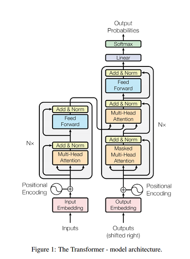
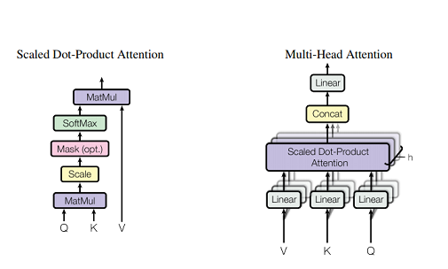
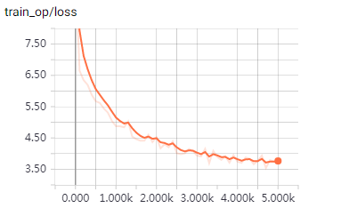

# transformer

TensorFlow implementation of [Attention Is All You Need](https://arxiv.org/abs/1706.03762). (2017. 6)

 

## Requirements

- Python 3.6
- TensorFlow 1.6
- nltk (tokenizer and blue score)
- tqdm (progress bar)


## Project Structure


    ├── config                  # Config files (.yml)
    ├── data                    # dataset path
    ├── transformer             # transformer architecture graphs (from input to logits)
        ├── __init__.py             # Graph logic
        ├── attention.py            # Attention (multi-head, scaled_dot_product and etc..)
        ├── encoder.py              # Encoder logic
        ├── decoder.py              # Decoder logic
        └── layer.py                # Layers (FFN)
    ├── data_loader.py          # raw_data -> processed_data -> generate_batch (using Dataset)
    ├── main.py                 # train and evaluate
    ├── utils.py                # config tools  
    └── model.py                # define model, loss, optimizer


## Config

example: iwslt15-en-vi.yml

```yml
data:
  base_path: 'data/'
  raw_data_path: 'iwslt15_en-vi'
  processed_path: 'processed_iwslt15_en-vi'
  word_threshold: 1

  PAD_ID: 0
  UNK_ID: 1
  START_ID: 2
  EOS_ID: 3

model:
  batch_size: 64
  num_layers: 3
  model_dim: 256
  num_heads: 4
  linear_key_dim: 16
  linear_value_dim: 16
  ffn_dim: 1024
  dropout: 0.1

train:
  warmup_steps: 1000
  optimizer: 'Adam' 
  
  train_steps: 5000
  model_dir: 'logs/iwslt15_en-vi'
  
  save_checkpoints_steps: 500
  check_hook_n_iter: 100
  min_eval_frequency: 2000
  
  debug: False
```

* `iwslt15_en-vi` [download here](https://nlp.stanford.edu/projects/nmt/)

## Run

Process raw data

```
python data_loader.py --config config/iwslt15_en-vi.yml
```

Train

```
python main.py --mode train --config config/iwslt15_en-vi.yml
```


## Tensorboard

```tensorboard --logdir logs```

- iwslt15-en-vi.yml (trained for 1hr on one Tesla K80)




