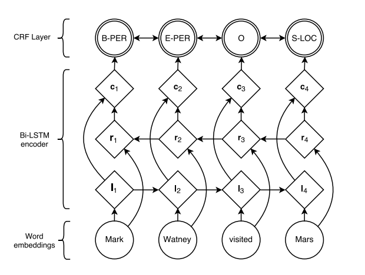

# BiLSTM-CRF 

TensorFlow implementation of [Neural Architectures for Named Entity Recognition](https://arxiv.org/pdf/1603.01360.pdf). (2016. 03)



## Requirements

- Python 3
- TensorFlow 1.5


## Project Structure


    ├── config                  # Config files (.yml)
    ├── data                    # dataset path
    ├── logs                    # checkpoints
    ├── architecture                # architecture graphs (from input to logits)
        ├── __init__.py             # Graph logic
    ├── data_loader.py          # raw_data -> precossed_data -> generate_batch (using Dataset)
    ├── main.py                 # train
    ├── predict.py              # predict
    ├── utils.py                # config tools
    └── model.py                # define model, loss, optimizer
    

## Config

example: ner.yml

```yml
data:
  base_path: 'data/'
  raw_path: 'raw_data/'
  processed_path: 'processed_data'
  wordvec_fname: 'glove.txt'
  tag_labels: ['身体部位', '治疗', '症状和体征', '检查和检验', '疾病和诊断']

model:
  lstm_unit: 100
  fc_unit: 21
  dropout_keep_prob: 0.5
  embedding_size: 64

train:
  batch_size: 16
  max_gradient_norm: 5.0
  learning_rate: 0.001
  learning_decay_steps: 500
  learning_decay_rate: 0.8
  optimizer: 'Adam'
  max_steps: 5000
  model_dir: 'logs/NER/bilstm-crf/'

  save_checkpoints_steps: 500
  check_hook_n_iter: 100

  debug: False
```


## Run

Process raw data

```
python data_loader.py --config config/ner.yml
```

Train

```
python main.py --config config/ner.yml
```

Predict  

[download pretrained model](https://drive.google.com/open?id=1OT_fQ7X5FpAotmJ2oDkpmvEaNusHNzov)  
Since the model was trained on medical dataset, it can only recognize medical entity.
```
python predict.py --config config/ner.yml
```

## Tensorboard


- ner.yml


## Example


```
input text > 现患者一般情况可，头顶部肿胀已消退，双肺呼吸音清晰，未闻及啰音，律齐，各瓣膜听诊区未闻及病理性杂音，腹平坦，软，全腹无压痛，无反跳痛及肌紧张，全腹未触及异常包块，左大腿轻度肿胀，压痛，表面可见淤青。神经系统查体未见异常。
result:
现患者一般情况可， {{头顶部(:身体部位)}}  {{肿胀(:症状和体征)}} 已消退， {{双肺(:身体部位)}}  {{呼吸音(:检查和检验)}} 清晰，未闻及 {{啰音(:检查和检验)}} ， {{律齐(:症状和体征)}} ， {{各瓣膜听诊区(:身体部位)}} 未闻及 {{病理性杂音(:检查和检验)}} ， {{腹(:身体部位)}} 平坦，软， {{全腹(:身体部位)}} 无 {{压痛(:检查和检验)}} ，无 {{反跳痛(:检查和检验)}} 及 {{肌紧张(:检查和检验)}} ， {{全腹(:身体部位)}} 未触及异常 {{包块(:症状和体征)}} ， {{左大腿(:身体部位)}} 轻度 {{肿胀(:症状和体征)}} ， {{压痛(:检查和检验)}} ，表面可见淤青。神经系统 {{查体(:检查和检验)}} 未见异常。

input text > 患者精神状况可，无发热，诉头晕明显减轻。饮食及二便正常。查：肺心腹未见异常。头颅无畸形，局部压痛明显减轻，左下颌皮肤破损已结痂。右腹股沟无明显肿胀，压痛明显减轻。右膝部挫伤已结痂，肿胀消退，右膝关节活动可。足背动脉搏动良好，足趾感觉及运动正常。神经系统查体未见异常。
result:
患者精神状况可，无 {{发热(:症状和体征)}} ，诉 {{头晕(:症状和体征)}} 明显减轻。饮食及 {{二便(:身体部位)}} 正常。查： {{肺(:身体部位)}}  {{心(:身体部位)}}  {{腹(:身体部位)}} 未见异常。 {{头颅(:身体部位)}} 无 {{畸形(:症状和体征)}} ，局部 {{压痛(:检查和检验)}} 明显减轻， {{左下颌皮肤(:身体部位)}} 破损已结痂。 {{右腹股沟(:身体部位)}} 无明显 {{肿胀(:症状和体征)}} ， {{压痛(:检查和检验)}} 明显减轻。 {{右膝部(:身体部位)}} 挫伤已结痂， {{肿胀(:症状和体征)}} 消退， {{右膝关节(:身体部位)}} 活动可。 {{足背动脉(:身体部位)}} 搏动良好， {{足趾(:身体部位)}} 感觉及运动正常。神经系统 {{查体(:检查和检验)}} 未见异常。

input text > 女，6岁，河北省承德市双滦区偏桥子镇杨泉子村5组人，主因"咳嗽、咳痰月余，加重伴发热1天"于2016年12月12日12:58以肺炎收入院。
result:
女，6岁，河北省承德市双滦区偏桥子镇杨泉子村5组人，主因" {{咳嗽(:症状和体征)}} 、 {{咳痰(:症状和体征)}} 月余，加重伴 {{发热(:症状和体征)}} 1天"于2016年12月12日12:58以 {{肺炎(:疾病和诊断)}} 收入院。
```


