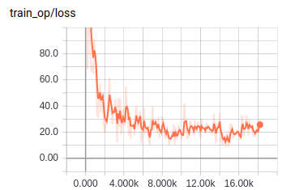

# BiRNN-CRF 

TensorFlow implementation of [Character-based Joint Segmentation and POS Tagging for Chinese
using Bidirectional RNN-CRF](https://arxiv.org/pdf/1704.01314.pdf). (2017. 04)


## Requirements

- Python 3
- TensorFlow 1.5


## Project Structure


    ├── config                  # Config files (.yml)
    ├── data                    # dataset path
    ├── logs                    # checkpoints
    ├── architecture                # architecture graphs (from input to logits)
        ├── __init__.py             # Graph logic
    ├── data_loader.py          # raw_data -> precossed_data -> generate_batch (using Dataset)
    ├── main.py                 # train
    ├── predict.py              # predict
    ├── utils.py                # config tools
    └── model.py                # define model, loss, optimizer
    

## Config

example: people1998.yml

```yml
data:
  base_path: 'data/'
  raw_data: 'people1998.txt'
  wordvec_fname: 'glove.txt'

model:
  gru_unit: 200
  fc_unit: 176
  dropout_keep_prob: 0.5
  embedding_size: 64

train:
  batch_size: 16
  max_gradient_norm: 5.0
  learning_rate: 0.001
  learning_decay_steps: 500
  learning_decay_rate: 0.9
  optimizer: 'Adam'
  max_steps: 20000
  model_dir: 'logs/seg_tag/birnn-crf/'

  save_checkpoints_steps: 700
  check_hook_n_iter: 100

  debug: False
```


## Run

Process raw data

```
python data_loader.py --config config/people1998.yml
```

Train

```
python main.py --config config/people1998.yml
```

Predict  
[download pretrained model](https://drive.google.com/open?id=1c9A6BkDDD-JweVoog2ETdbi3bfmd0PLw)  
```
python predict.py --config config/people1998.yml
```

## Tensorboard


- people1998.yml (trained for 4 hrs on one 1070Ti)




## Example


```
input text > 目前我们已经安排了专门人员对这两枚导弹进行研究，研究结果将用于提高俄罗斯的武器系统
result > 目前/t 我们/r 已经/d 安排/v 了/u 专门/b 人员/n 对/p 这/r 两/m 枚/q 导弹/n 进行/v 研究/vn ，研究/vn 结果/n 将/d 用于/v 提高/v 俄罗斯/ns 的/u 武器/n 系统/n

input text > 一块由大屏幕、摄像探头和喇叭组成的新型违章抓拍系统被设立在街头。
result >  一/m 块/q 由/p 大/a 屏幕/n 、摄像/v 探头/n 和/c 喇叭/n 组成/v 的/u 新型/b 违章/vn 抓拍/vn 系统/n 被/p 设立/v 在/p 街头/s 。

input text > 在美国空袭过后，叙利亚军队发现了两枚没有爆炸的巡航导弹。
result >  在/p 美国/ns 空袭/v 过/v 后/f ，叙利亚/ns 军队/n 发现/v 了/u 两/m 枚/q 没有/d 爆炸/v 的/u 巡航/vn 导弹/n 。
```


