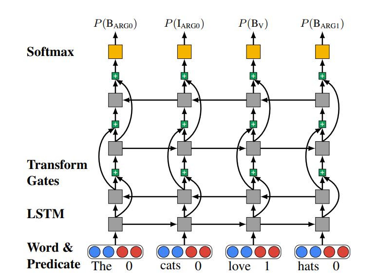

# BiLSTM-Highway

TensorFlow implementation of [Deep Semantic Role Labeling: What Works and What’s Next](https://homes.cs.washington.edu/~luheng/files/acl2017_hllz.pdf). (2017)



## Requirements

- Python 3
- TensorFlow 1.5


## Project Structure


    ├── config                  # Config files (.yml)
    ├── data                    # dataset path
    ├── architecture                # architecture graphs (from input to logits)
        ├── __init__.py             # Graph logic
    ├── data_loader.py          # raw_data -> precossed_data -> generate_batch (using Dataset)
    ├── main.py                 # train
    ├── utils.py                # config tools
    └── model.py                # define model, loss, optimizer
    

## Config

example: sample.yml

```
data:
  base_path: 'data/'
  wordvec_file: 'word_emb.pkl'

model:
  num_lstm_layer: 4
  num_class: 89
  lstm_unit: 200

train:
  batch_size: 80
  learning_rate: 0.001
  clip_gradients: 1.0

  keep_prob: 0.9

  epoch: 500
  model_dir: 'logs/bilstm-highway'

  save_checkpoints_steps: 1000
  check_hook_n_iter: 100

  debug: False
```


## Run

Process raw data

```
python data_loader.py --config config/sample.yml
```

Train  

The data must follow the format of sample.txt, used as a sample with only 5 lines, which is far away from enough.  
I can't find public annotated data for this model, please contact me if you would like to share your data.

```
python main.py --config config/sample.yml
```

